# EPR Normalized ERD (India Trademark-Aware)

This document describes a normalized ERD extension for EPR workflows with trademark ownership/authorization tracking for India.

## Scope and assumptions

- This model is designed as a non-breaking extension over the existing ERP schema.
- It supports traceability for brand owner authorization and EPR obligation fulfillment.
- It is a technical guidance model and not legal advice.
- Validate final compliance implementation against current CPCB/SPCB notifications and the latest Trade Marks Rules, 2017 updates.

## Normalization approach

- 1NF: Atomic attributes (for example trademark numbers, class numbers, status codes).
- 2NF: M:N relationships are decomposed into bridge tables (material scopes, state scopes, certificate allocations).
- 3NF: Reference data (roles, material categories, states) is isolated in master tables.

## ERD

```mermaid
erDiagram
  PARTY_MASTER ||--o{ EPR_ORGANIZATION_ROLE_ASSIGNMENTS : has
  EPR_ROLE_MASTER ||--o{ EPR_ORGANIZATION_ROLE_ASSIGNMENTS : classifies

  PARTY_MASTER ||--o{ INDIA_TRADEMARK_REGISTRY : owns
  INDIA_TRADEMARK_REGISTRY ||--o{ INDIA_TRADEMARK_OWNERSHIP_HISTORY : tracks
  PARTY_MASTER ||--o{ INDIA_TRADEMARK_OWNERSHIP_HISTORY : holder

  INDIA_TRADEMARK_REGISTRY ||--o{ EPR_BRAND_AUTHORIZATIONS : authorizes
  PARTY_MASTER ||--o{ EPR_BRAND_AUTHORIZATIONS : brand_owner
  PARTY_MASTER ||--o{ EPR_BRAND_AUTHORIZATIONS : authorized_entity

  PARTY_MASTER ||--o{ EPR_REGISTRATIONS : registers
  EPR_ROLE_MASTER ||--o{ EPR_REGISTRATIONS : registration_role

  EPR_REGISTRATIONS ||--o{ EPR_REGISTRATION_MATERIAL_SCOPES : includes
  CPCB_MATERIAL_CATEGORY_MASTER ||--o{ EPR_REGISTRATION_MATERIAL_SCOPES : material

  EPR_REGISTRATIONS ||--o{ EPR_REGISTRATION_STATE_SCOPES : applies_in
  INDIA_STATE_MASTER ||--o{ EPR_REGISTRATION_STATE_SCOPES : state

  EPR_REGISTRATIONS ||--o{ EPR_ANNUAL_OBLIGATIONS : incurs
  CPCB_MATERIAL_CATEGORY_MASTER ||--o{ EPR_ANNUAL_OBLIGATIONS : category

  PARTY_MASTER ||--o{ EPR_RECYCLING_CERTIFICATES : issuer
  PARTY_MASTER ||--o{ EPR_RECYCLING_CERTIFICATES : beneficiary
  CPCB_MATERIAL_CATEGORY_MASTER ||--o{ EPR_RECYCLING_CERTIFICATES : material

  EPR_RECYCLING_CERTIFICATES ||--o{ EPR_CERTIFICATE_ALLOCATIONS : allocates
  EPR_ANNUAL_OBLIGATIONS ||--o{ EPR_CERTIFICATE_ALLOCATIONS : settles

  EPR_REGISTRATIONS ||--o{ EPR_FILING_EVENTS : files

  EPR_REGISTRATIONS ||--o{ EPR_BRAND_COMPLIANCE_LINKS : links
  EPR_BRAND_AUTHORIZATIONS ||--o{ EPR_BRAND_COMPLIANCE_LINKS : governs

  DOCUMENT_ATTACHMENTS ||--o{ INDIA_TRADEMARK_OWNERSHIP_HISTORY : evidence
  DOCUMENT_ATTACHMENTS ||--o{ EPR_BRAND_AUTHORIZATIONS : authorization_doc
  DOCUMENT_ATTACHMENTS ||--o{ EPR_REGISTRATIONS : registration_doc
  DOCUMENT_ATTACHMENTS ||--o{ EPR_RECYCLING_CERTIFICATES : certificate_doc
```



## Key compliance design points

- Trademark controls:
  - `india_trademark_registry` stores application number, registration number, Nice class (1-45), status, filing/registration/expiry dates.
  - `india_trademark_ownership_history` captures ownership/licensing transitions over time.
- Brand owner authorization for EPR:
  - `epr_brand_authorizations` records who authorized whom, scope, period, and supporting document.
- EPR registration scope:
  - Registration is separated from material and state scopes via two bridge tables.
- Obligation and evidence chain:
  - Annual obligations are tracked by material and year.
  - Certificates are allocated through `epr_certificate_allocations` for auditable settlement.
- Filing traceability:
  - `epr_filing_events` tracks quarterly/annual/amendment filings and acknowledgement references.

## Suggested integrity checks

- Add a trigger to ensure allocated certificate quantity does not exceed issued quantity.
- Add a trigger to enforce authorization date validity for linked compliance year.
- Add application-level validation for:
  - trademark-owner relationship consistency,
  - active registration status during filing,
  - category match between obligation and allocated certificate.

## Where implemented

- SQL implementation is in `database/erp-normalization.sql` under section `6) EPR + India trademark compliance foundation (normalized)`.

## API examples (Swagger-aligned)

Base path: `/api/epr`

### 1) Create registration

`POST /registrations`

Request:

```json
{
  "registrantPartyId": 1,
  "eprRoleId": 3,
  "registrationNumber": "CPCB-EPR-2026-0001",
  "registrationAuthority": "CPCB",
  "registrationStatus": "ACTIVE",
  "issueDate": "2026-04-01",
  "expiryDate": "2027-03-31"
}
```

Response `201` (example):

```json
{
  "id": 1,
  "registrantPartyId": 1,
  "eprRoleId": 3,
  "registrationNumber": "CPCB-EPR-2026-0001",
  "registrationAuthority": "CPCB",
  "registrationStatus": "ACTIVE",
  "issueDate": "2026-04-01",
  "expiryDate": "2027-03-31",
  "createdAt": "2026-09-17T11:40:00.000Z",
  "updatedAt": "2026-09-17T11:40:00.000Z"
}
```

### 2) Create annual obligation

`POST /obligations`

Request:

```json
{
  "eprRegistrationId": 1,
  "obligationYear": "2026-27",
  "materialCategoryId": 1,
  "targetQuantityMt": 120.5,
  "carryForwardMt": 10.0
}
```

Response `201` (example):

```json
{
  "id": 1,
  "eprRegistrationId": 1,
  "obligationYear": "2026-27",
  "materialCategoryId": 1,
  "targetQuantityMt": 120.5,
  "carryForwardMt": 10.0,
  "createdAt": "2026-09-17T11:50:00.000Z",
  "updatedAt": "2026-09-17T11:50:00.000Z"
}
```

### 3) Create certificate

`POST /certificates`

Request:

```json
{
  "certificateNumber": "RC-2026-0001",
  "issuerPartyId": 2,
  "beneficiaryPartyId": 1,
  "materialCategoryId": 1,
  "certificateQuantityMt": 50.0,
  "issueDate": "2026-07-01"
}
```

Response `201` (example):

```json
{
  "id": 1,
  "certificateNumber": "RC-2026-0001",
  "issuerPartyId": 2,
  "beneficiaryPartyId": 1,
  "materialCategoryId": 1,
  "certificateQuantityMt": 50.0,
  "issueDate": "2026-07-01",
  "statusCode": "ACTIVE",
  "createdAt": "2026-09-17T12:00:00.000Z"
}
```

### 4) Allocate certificate quantity

`POST /certificate-allocations`

Request:

```json
{
  "certificateId": 1,
  "eprObligationId": 1,
  "allocatedQuantityMt": 20.0,
  "allocationDate": "2026-07-15"
}
```

Response `201` (example):

```json
{
  "id": 1,
  "certificateId": 1,
  "eprObligationId": 1,
  "allocatedQuantityMt": 20.0,
  "allocationDate": "2026-07-15",
  "createdAt": "2026-09-17T12:05:00.000Z"
}
```

### 5) Create filing event

`POST /filings`

Request:

```json
{
  "eprRegistrationId": 1,
  "filingPeriod": "Q1-2026-27",
  "filingType": "QUARTERLY",
  "filingStatus": "SUBMITTED",
  "acknowledgementNumber": "ACK-12345",
  "dueOn": "2026-07-30",
  "filingPayload": {
    "portalReference": "TXN-456",
    "notes": "Initial quarterly filing"
  }
}
```

Response `201` (example):

```json
{
  "id": 1,
  "eprRegistrationId": 1,
  "filingPeriod": "Q1-2026-27",
  "filingType": "QUARTERLY",
  "filingStatus": "SUBMITTED",
  "acknowledgementNumber": "ACK-12345",
  "submittedOn": "2026-09-17T11:45:00.000Z",
  "dueOn": "2026-07-30",
  "filingPayload": {
    "portalReference": "TXN-456",
    "notes": "Initial quarterly filing"
  },
  "createdAt": "2026-09-17T11:45:00.000Z",
  "updatedAt": "2026-09-17T11:45:00.000Z"
}
```

### 6) List endpoints

- `GET /registrations?partyId=1&status=ACTIVE`
- `GET /obligations?registrationId=1`
- `GET /certificates?beneficiaryPartyId=1`
- `GET /filings?registrationId=1`

All list endpoints return `200` with array responses matching the Swagger response DTO models.
